# Dormitory Maintenance Worklist System


## 1. Executive Summary

The Dormitory Maintenance Worklist System coordinates maintenance requests in student dormitories. Students submit problems such as plumbing, electrical, furniture, or heating faults. An administrator reviews every request, a technician assesses and repairs the problem, an inventory manager issues materials when necessary, and the student confirms the result.

The project was implemented with the **Cloud Process Execution Engine (CPEE)** and its Worklist service. It consists of three process models:

1. **Main-Sync** – a continuously running request intake process with synchronized access to the student form.
2. **Main-Async** – a continuously running request intake process that accepts concurrent submissions through an internal FIFO queue.
3. **Dormitory Maintenance Worklist System** – the reusable subprocess that handles one complete maintenance request.

The two main processes use the same maintenance subprocess and both start it with `fork_running`. The key difference is therefore **not** whether the subprocess runs in the background. The difference is how student submissions are accepted:

- Main-Sync uses `By Single Worker`. One student claims the current form, and other students must wait until a new form is created.
- Main-Async uses `Always Available`. Multiple students can open and submit the form independently, and every submission is appended to `data.queue`.


## 2. Actors and Responsibilities

| Actor | Responsibilities |
|---|---|
| Student | Submit a maintenance request; confirm the repair result; provide rating and feedback. |
| Administrator | Review the request; approve or reject it; optionally leave a note. |
| Technician | Inspect the problem; identify required materials; perform the repair; document the result. |
| Inventory Manager | Issue materials requested by a technician. |

### 2.1 Dormitory Units

The organisation model contains four units:

- Garching
- Olympiazentrum
- Studentenstadt
- Giesing

### 2.2 Demonstration Users

| Display name | Worklist UID | Role / Unit |
|---|---|---|
| Renny | `go34sat-renny` | Student |
| Lina | `go34sat-lina` | Student |
| Admin Jenny | `go34sat-admin-jenny` | Admin for all units |
| Technician Daniel | `go34sat-tech-garching` | Technician, Garching |
| Technician Sophie | `go34sat-tech-olympia` | Technician, Olympiazentrum |
| Technician Leon | `go34sat-tech-stusta` | Technician, Studentenstadt |
| Technician Mia | `go34sat-tech-giesing` | Technician, Giesing |
| Inventory Markus | `go34sat-inv-markus` | InventoryManager for all units |

The public CPEE demonstration Worklist does not require a password. The UID selects the organisational subject whose tasks are displayed.

---

## 3 System Architecture

The system follows a main-process/subprocess architecture.

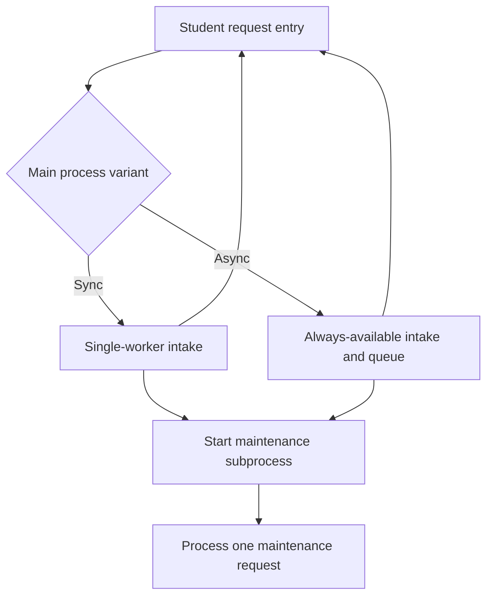
```mermaid
flowchart TD
    S[Student request entry] --> M{Main process variant}
    M -->|Sync| SY[Single-worker intake]
    M -->|Async| AS[Always-available intake and queue]
    SY --> F[Start maintenance subprocess]
    AS --> F
    F --> P[Process one maintenance request]
    SY --> S
    AS --> S
```

The main processes are intentionally small. They accept requests, prepare request data, and start the subprocess. All business logic is placed in the reusable maintenance subprocess.

### 3.1 Main-Sync Model



**Figure 1. Main-Sync process model.** The process waits for a single student submission, starts a maintenance subprocess, and loops back to create the next request task.

### 3.2 Main-Async Model



**Figure 2. Main-Async process model.** One branch keeps the student form continuously available. The second branch polls a queue and starts a subprocess for every queued request.

### 3.3 Maintenance Subprocess



**Figure 3. Dormitory Maintenance Worklist System subprocess.** One instance represents one maintenance request from administrative review to student confirmation.

---

## 4. Main-Sync Design

### 4.1 Intended Behaviour

Main-Sync synchronizes access to the request form. The Worklist task uses the handling mode `By Single Worker`:

1. The task is initially visible to all users with the Student role.
2. When one student selects **Do it!**, that student claims the task.
3. Other students no longer see that particular Sync task.
4. The claiming student submits the request.
5. The process starts a maintenance subprocess using `fork_running`.
6. The main loop immediately returns to the beginning and creates a new request task.

The maintenance work does not block the next request. Only access to the current input task is synchronized.

### 4.2 Student Task Configuration

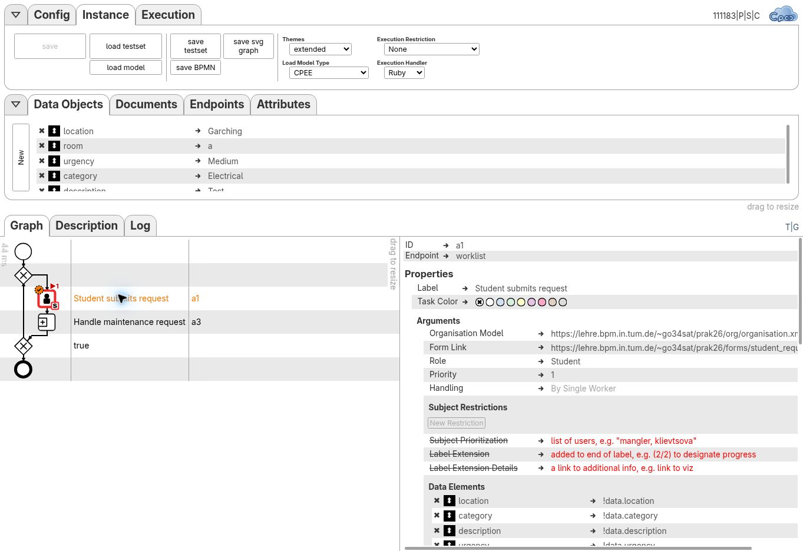

**Figure 4. Sync student task configuration.** The role is Student and handling is `By Single Worker`. The five request fields are connected to the main process data objects.

### 4.3 Finalize Logic

The Sync task ends after a form submission. Its `Finalize` section converts the returned Worklist field array into a hash and writes the values to process data objects:

```ruby
form = result["raw"].to_h { |field| [field["name"], field["value"]] }
data.location = form["location"]
data.room = form["room"]
data.category = form["category"]
data.description = form["description"]
data.urgency = form["urgency"]
```

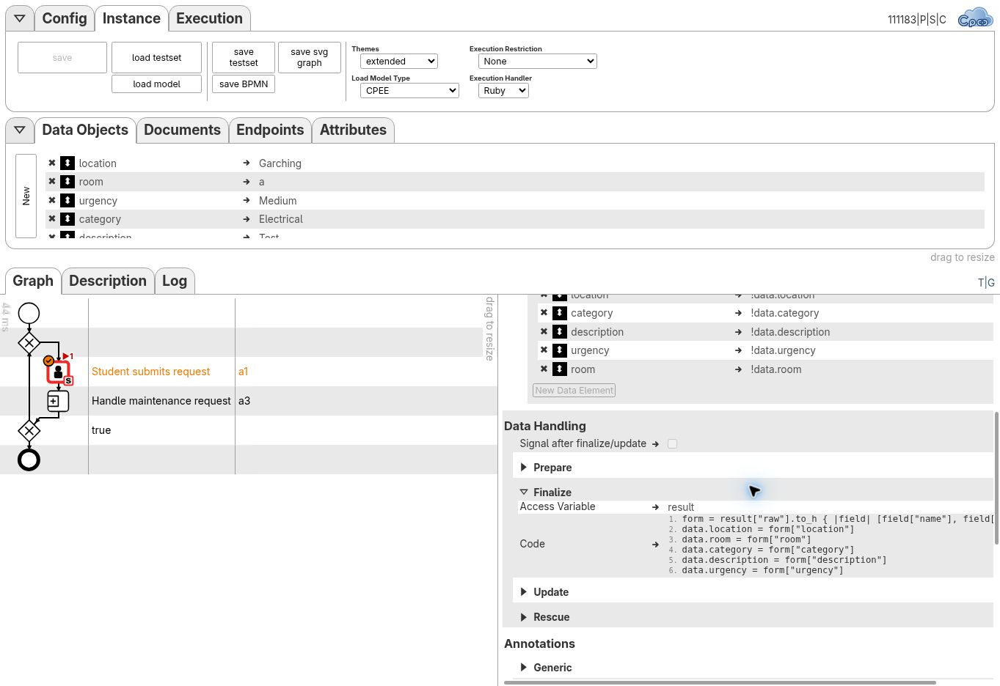

**Figure 5. Sync `Finalize` mapping.** Form results are copied into the main process before the subprocess is created.

### 4.4 Subprocess Call

The subprocess call receives the five request values as initialization data. Its mode is `fork_running`.

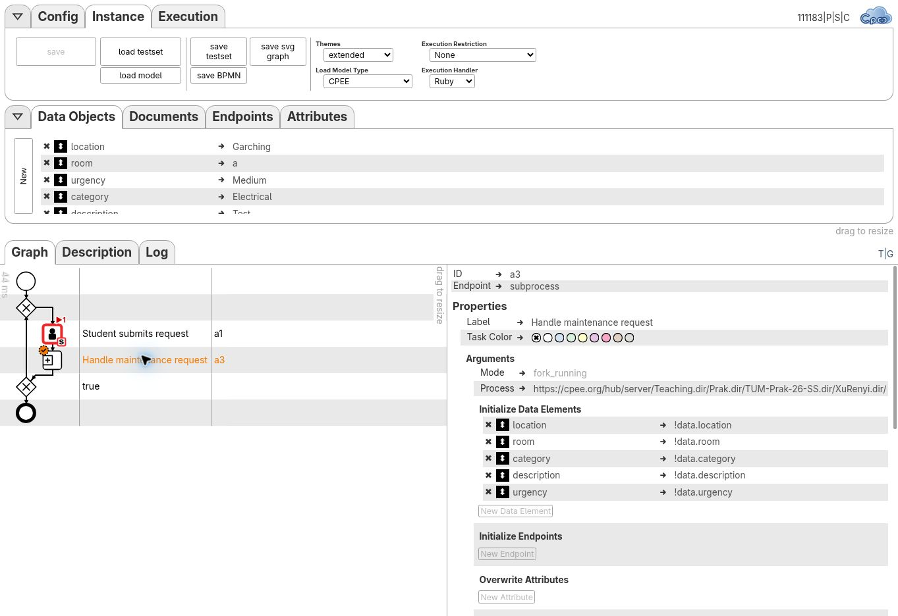

**Figure 6. Sync subprocess configuration.** `fork_running` starts the maintenance instance and allows Main-Sync to continue without waiting for it to finish.

### 4.5 Why This Variant Is Called Sync

The name refers to **synchronized access to the student request task**, not to synchronous subprocess execution. The subprocess is still forked. Students are synchronized only while claiming the current input task.

---

## 5. Main-Async Design

### 5.1 Intended Behaviour

Main-Async keeps the request form continuously available and separates data collection from data processing:

1. The student task uses `Always Available`.
2. Every form submission creates a request object.
3. The task's `Update` code appends that object to `data.queue`.
4. A parallel worker loop checks whether the queue contains an item.
5. The oldest item is removed with `shift` and stored in `data.item`.
6. A maintenance subprocess is started with values from `data.item`.
7. The worker returns to the queue check.
8. The student form remains available throughout this operation.

### 5.2 Student Task Configuration

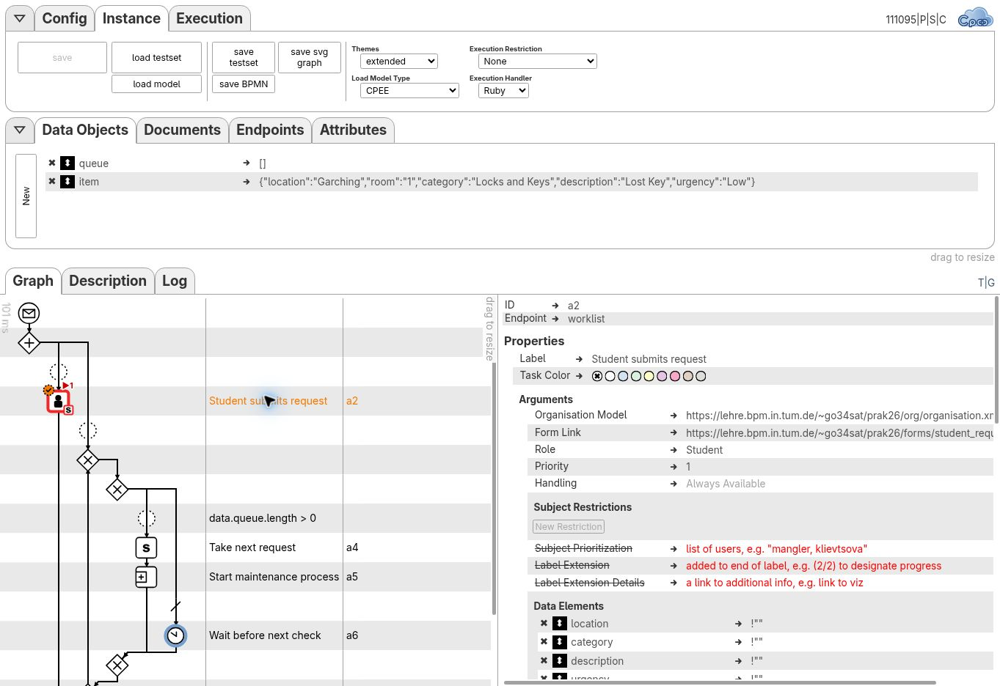

**Figure 7. Async student task configuration.** `Always Available` permits multiple students to open and submit the same logical Worklist task.

The task input fields are initialized independently rather than from shared main-process request fields. This prevents one student's partially filled form from inheriting another request's values.

### 5.3 Why Async Uses Update Instead of Finalize

This is a central implementation difference:

- `Finalize` is executed when a normal task finishes.
- An `Always Available` task is designed to remain active after a submission.
- Therefore, each Async submission must be handled in `Update` while the task continues running.

The Update logic creates one request object and pushes it into the queue:

```ruby
form = result["raw"].to_h { |field| [field["name"], field["value"]] }

data.queue.push({
  "location" => form["location"],
  "room" => form["room"],
  "category" => form["category"],
  "description" => form["description"],
  "urgency" => form["urgency"]
})
```

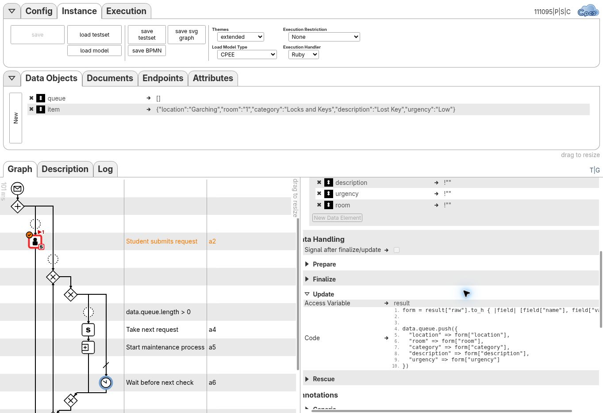

**Figure 8. Async Update logic.** Every submission is appended as a separate queue item.

### 5.4 Queue Processing

The worker branch uses the condition:

```ruby
data.queue.length > 0
```

When the condition is true, the next request is removed in FIFO order:

```ruby
data.item = data.queue.shift
```

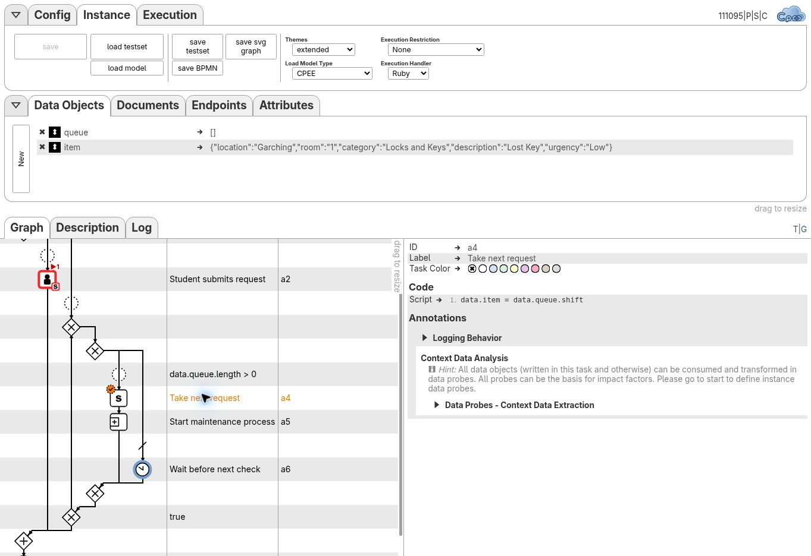

**Figure 9. Queue consumption.** `shift` removes the oldest request and prevents the same request from being processed twice.

When the queue is empty, a short wait step prevents the process from executing an uncontrolled tight loop.

### 5.5 Subprocess Call

The subprocess is initialized from the current queue item:

```ruby
data.item["location"]
data.item["room"]
data.item["category"]
data.item["description"]
data.item["urgency"]
```

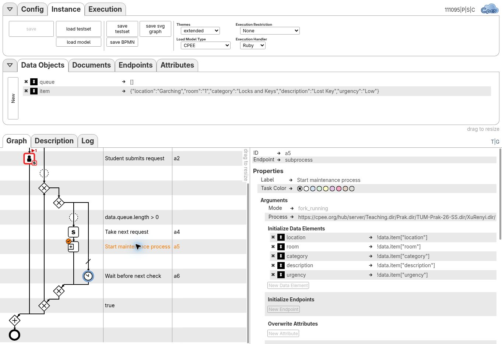

**Figure 10. Async subprocess configuration.** Each dequeued item becomes the initialization data for a new `fork_running` maintenance instance.

### 5.6 Queue Properties

The queue is:

- **FIFO:** requests are processed in arrival order;
- **in-process:** it is stored in the Main-Async CPEE instance;
- **non-durable:** it is suitable for a course demonstration but is not a replacement for a persistent production message broker;
- **decoupled:** students submit to the queue without waiting for the maintenance subprocess.

---

## 6. Sync and Async Comparison

| Aspect | Main-Sync | Main-Async |
|---|---|---|
| Student task handling | `By Single Worker` | `Always Available` |
| Form access | One student claims the current task | Multiple students can open the form |
| Submission processing | Task completes once | Task remains active |
| CPEE code section | `Finalize` | `Update` |
| Intermediate structure | Direct process data objects | `data.queue` and `data.item` |
| Concurrent form submissions | No, not on the same task | Yes |
| Request order | Sequential task completion | FIFO queue order |
| Subprocess mode | `fork_running` | `fork_running` |
| New requests during repair | Yes, after a new intake task is created | Yes, continuously |
| Complexity | Lower | Higher |
| Best use | Simple controlled intake | High-volume concurrent intake |

### 6.1 Behavioural Interpretation

Suppose Student A submits a request and the maintenance case has already reached InventoryManager:

- In **Main-Sync**, Student B can submit as soon as the main loop has created the next request task. Student B does not wait for Student A's repair to finish. However, only one student can claim each current Sync form.
- In **Main-Async**, Student B can open and submit the always-available form even while another student is currently filling it. Both submissions are queued and processed independently.

---

## 7. Maintenance Subprocess

The subprocess contains the full business workflow for one request.

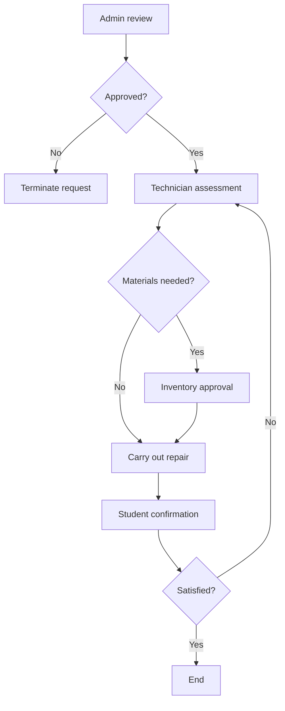
```mermaid
flowchart TD
    A[Admin review] --> D{Approved?}
    D -->|No| X[Terminate request]
    D -->|Yes| T[Technician assessment]
    T --> M{Materials needed?}
    M -->|Yes| I[Inventory approval]
    M -->|No| R[Carry out repair]
    I --> R
    R --> C[Student confirmation]
    C --> S{Satisfied?}
    S -->|No| T
    S -->|Yes| E[End]
```

### 6.1 Administrative Review

The administrator sees the submitted request data and selects one of two decisions:

- `approved`
- `rejected`

The earlier `returned` option was removed to keep the final workflow clear and avoid a second student-revision loop. A rejected request terminates; an approved request proceeds to technician assessment.

### 6.2 Technician Assessment

The technician receives:

- location;
- room;
- category;
- description;
- urgency.

The technician records:

- whether materials are needed;
- a list of required materials;
- assessment notes.

The HTML radio value is converted to a Boolean:

```ruby
data.materials_needed = form["materials_needed"] == "true"
```

### 6.3 Inventory Approval

The InventoryManager task is executed only when:

```ruby
data.materials_needed == true
```

The manager sees the request location, room, and materials list and confirms that the materials were issued.

### 6.4 Repair Completion

The technician sees assessment information and materials data, performs the repair, and records `repair_notes`.

### 6.5 Student Confirmation

The student receives the repair notes and submits:

- `satisfied` – `true` or `false`;
- `rating` – integer from 1 to 5;
- `feedback` – optional text.

The values are converted in Finalize:

```ruby
data.satisfied = form["satisfied"] == "true"
data.rating = form["rating"].to_i
data.feedback = form["feedback"]
```

The repair loop uses a post-test condition:

```ruby
data.satisfied == false
```

The loop repeats only if the student reports that the issue is not resolved.

---

## 7. Process Data Model

### 7.1 Maintenance Subprocess Data Objects

| Data object | Type / representation | Initial value | Purpose |
|---|---|---|---|
| `location` | String | Empty | Dormitory unit |
| `room` | String | Empty | Room identifier |
| `category` | String | Empty | Problem category |
| `description` | String | Empty | Student's problem description |
| `urgency` | String | Empty | Low, Medium, or High |
| `admin_decision` | String | Empty | Approved or rejected |
| `admin_note` | String | Empty | Optional administrator note |
| `materials_needed` | Boolean | `false` | Controls the inventory branch |
| `materials_list` | String | Empty | Materials requested by technician |
| `materials_issued` | Boolean | `false` | Inventory confirmation |
| `assessment_notes` | String | Empty / None | Technician assessment |
| `repair_notes` | String | Empty | Repair completion information |
| `satisfied` | Boolean | `false` | Controls the repair loop |
| `rating` | Integer | `0` | Student rating from 1 to 5 |
| `feedback` | String | Empty | Optional student feedback |

### 7.2 Main-Async Data Objects

| Data object | Type | Purpose |
|---|---|---|
| `queue` | Array | Stores all submitted but not yet dispatched requests |
| `item` | Hash / object | Stores the request currently removed from the queue |

### 7.3 Data Boundary

The main process passes request data into the subprocess at creation time. After that point, the child instance owns its own copy. Administrator, technician, inventory, and confirmation results remain inside that child instance. This prevents parallel requests from overwriting each other.

---

## 8. Worklist Forms

The frontend consists of six HTML form fragments and one shared stylesheet:

| File | Task |
|---|---|
| `student_request.html` | Student request submission |
| `admin_review.html` | Administrative approval or rejection |
| `technician_assessment.html` | On-site assessment and material requirements |
| `inventory_approval.html` | Confirmation that materials were issued |
| `repair_complete.html` | Repair completion notes |
| `student_confirmation.html` | Student satisfaction, rating, and feedback |
| `worklist.css` | Shared styling |

### 8.1 Worklist Form Contract

Every submitted control follows this pattern:

```html
<input
  form="worklist-form"
  type="text"
  name="room"
  id="room"
  required>
```

The attributes have distinct purposes:

- `form="worklist-form"` associates the control with the form generated by the CPEE Worklist container.
- `name="room"` determines the field name returned in `result["raw"]`.
- `id="room"` connects the control to its `<label>`.
- `required` enables browser-side validation.

The submit button follows the same convention:

```html
<input form="worklist-form" type="submit" value="Submit request">
```

No custom `fetch`, callback URL, `URLSearchParams`, or `onclick` submission code is required. The Worklist container handles the callback to CPEE.

### 8.2 Data Display

Later workflow forms use `<worklist-form-load>` to display values supplied by the CPEE task:

```javascript
var values = {};
data.forEach(function(item) {
  values[item.name] = item.value;
});

$(".location", $(form_area)).text(values.location || "—");
$(".room", $(form_area)).text(values.room || "—");
```

If a field displays `—`, the cause is normally not the HTML itself. It means that the corresponding CPEE task Data Element was not supplied or its name did not match.

### 8.3 Naming Consistency

The following names must match exactly across all layers:

```text
HTML name
    ↕
CPEE task Data Element name
    ↕
Ruby form["name"] key
    ↕
Process data.name
```

For example, `assessment_notes` must not be changed to `assessmentNotes`, `assessment-note`, or another spelling in one layer.

---

## 9. Organisation Model

The organisation model is stored in:

```text
org/organisation.xml
```

Its public deployment URL is:

```text
https://lehre.bpm.in.tum.de/~go34sat/prak26/org/organisation.xml
```

Each Worklist task uses:

- the organisation model URL;
- a role;
- optionally a unit;
- priority `1`;
- a handling mode.

Technicians are separated by dormitory unit so that maintenance work can be routed to the relevant location. The administrator and inventory manager cover all four units.

### 9.1 Known Demonstration Limitation

Student confirmation is currently role-based. Therefore, both Renny and Lina may see a Student confirmation task even when only one of them submitted the original request. A production design should store the requester's UID and add a subject restriction to later student tasks.

---

## 10. Repository Structure

```text
dormitory-maintenance-workflow/
├── README.md
├── DOCUMENTATION.md
├── Dormitory_Maintenance_Requirements.md
├── forms/
│   ├── admin_review.html
│   ├── inventory_approval.html
│   ├── repair_complete.html
│   ├── student_confirmation.html
│   ├── student_request.html
│   ├── technician_assessment.html
│   └── worklist.css
├── models/
│   ├── Dormitory Maintenance Worklist System.xml
│   ├── Main-Async.xml
│   └── Main-Sync.xml
├── org/
│   └── organisation.xml
└── docs/
    └── images/
```


## 11. Deployment and Execution

### 11.1 Hosted Resources

The HTML forms and organisation model are hosted under:

```text
https://lehre.bpm.in.tum.de/~go34sat/prak26/
```

The Worklist form links use URLs such as:

```text
https://lehre.bpm.in.tum.de/~go34sat/prak26/forms/student_request.html
https://lehre.bpm.in.tum.de/~go34sat/prak26/forms/admin_review.html
```

### 11.2 Demonstration Instances

| Model | Instance | URL |
|---|---:|---|
| Main-Sync | 111183 | <https://cpee.org/flow/edit.html?monitor=https://cpee.org/flow/engine/111183/> |
| Main-Async | 111095 | <https://cpee.org/flow/edit.html?monitor=https://cpee.org/flow/engine/111095/> |
| Maintenance subprocess model | 111092 | <https://cpee.org/flow/edit.html?monitor=https://cpee.org/flow/engine/111092/> |

These numbers identify the current demonstration instances. New test instances may receive different IDs.

### 11.3 Worklist Access

Examples:

```text
https://cpee.org/worklist/?user=go34sat-renny
https://cpee.org/worklist/?user=go34sat-lina
https://cpee.org/worklist/?user=go34sat-admin-jenny
```

After entering the UID, select **get Worklist**.

### 11.4 Starting a New Test

1. Open the desired CPEE model or create a new instance from that model.
2. Open the **Execution** tab.
3. Select **Start**.
4. Open the Worklist with a Student UID.
5. Submit a request.
6. Open the administrator Worklist and continue the generated child process.
7. Switch to the technician, inventory manager, and student users as required.

Starting the same saved model again creates a new process instance. Each instance has its own data objects and execution state.

---

## 12. Verification and Test Results

### 12.1 Initial Availability

Before a Sync task was claimed, both students could see the Sync and Async request tasks.

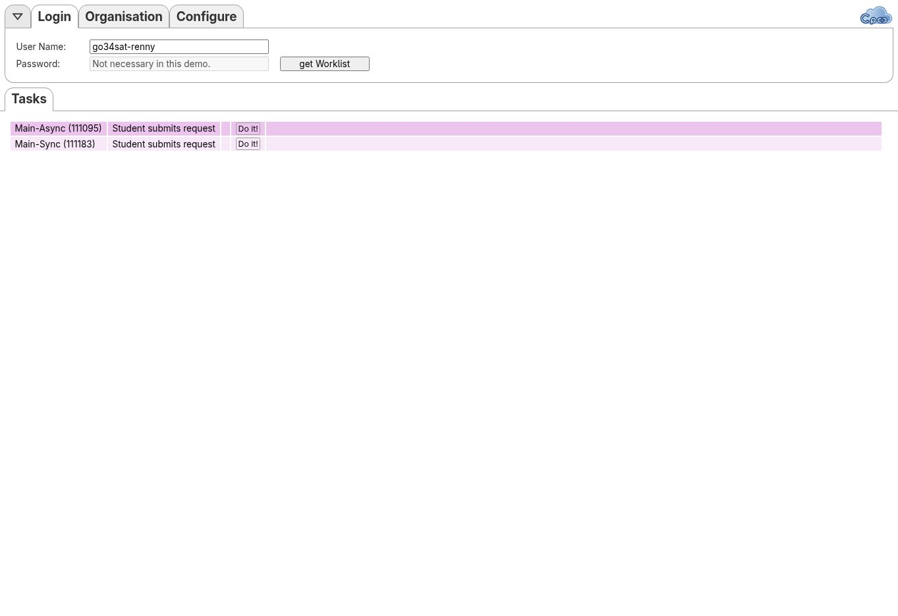


**Figures 11–12. Initial Worklist state.** Both request-entry variants are available to both Student users.

### 12.2 Sync Locking Test

Renny selected the Main-Sync task and opened the request form.

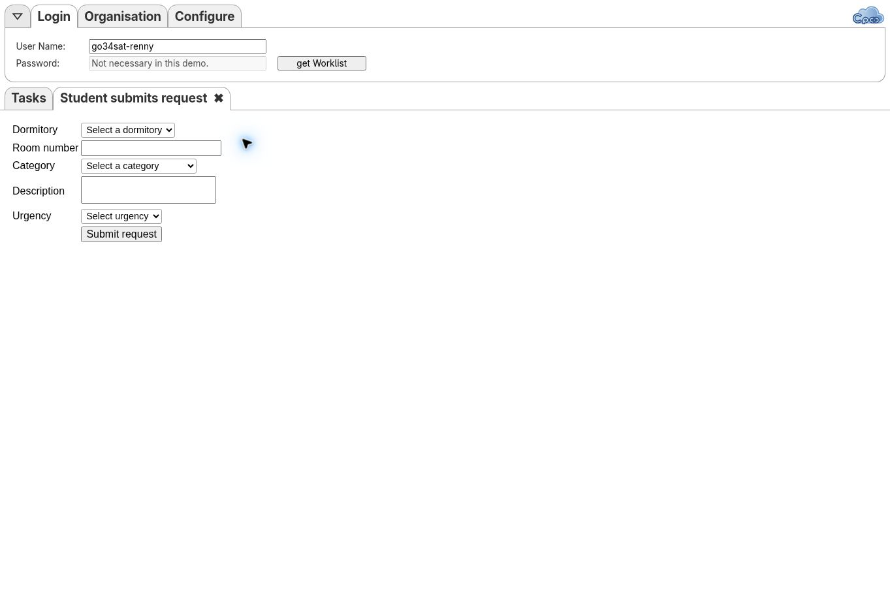

At the same time, Lina's Worklist showed only Main-Async.

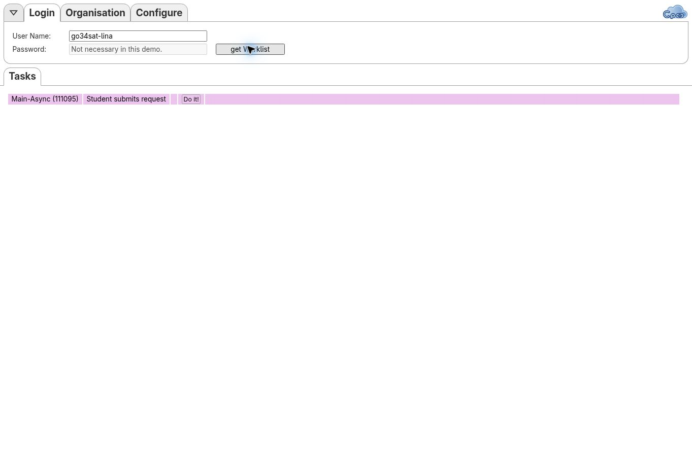

**Result:** Passed. `By Single Worker` correctly hides the claimed Sync task from another Student user.

### 12.3 Async Concurrent-Access Test

Lina opened the Main-Async request form.

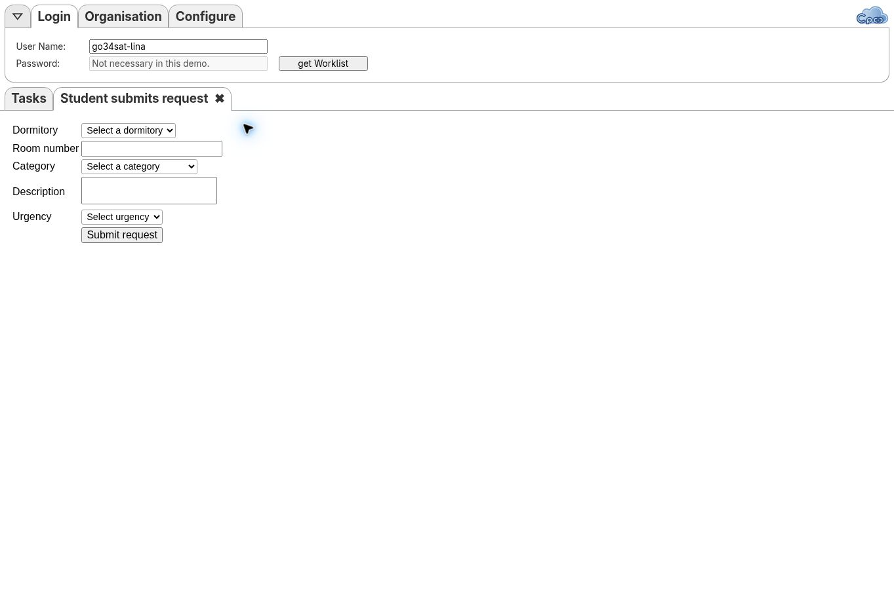

While Lina had the form open, Renny's Worklist still displayed Main-Async.

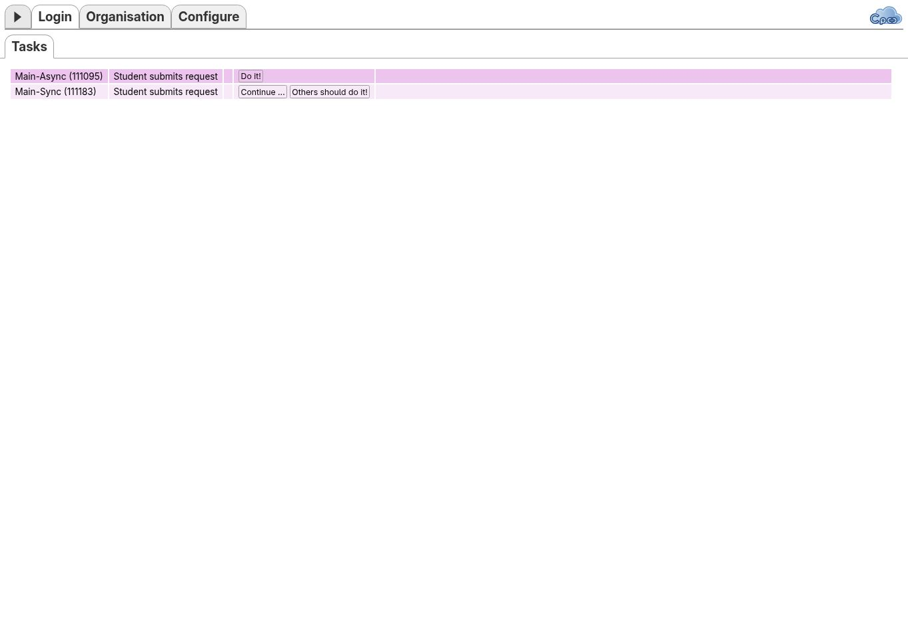

**Result:** Passed. `Always Available` allows concurrent access.

### 12.4 Submitted Test Data

| Source | Location | Room | Category | Description | Urgency |
|---|---|---|---|---|---|
| Main-Sync | Garching | `SYNC-101` | Plumbing | `SYNC TEST - leaking sink` | Medium |
| Main-Async | Olympiazentrum | `ASYNC-201` | Electrical | `ASYNC TEST - desk lamp outlet` | Low |

### 12.5 Continuous Intake Test

After the Sync request was submitted, a new Main-Sync request task immediately appeared.


After the Async request was submitted, the always-available task remained visible.

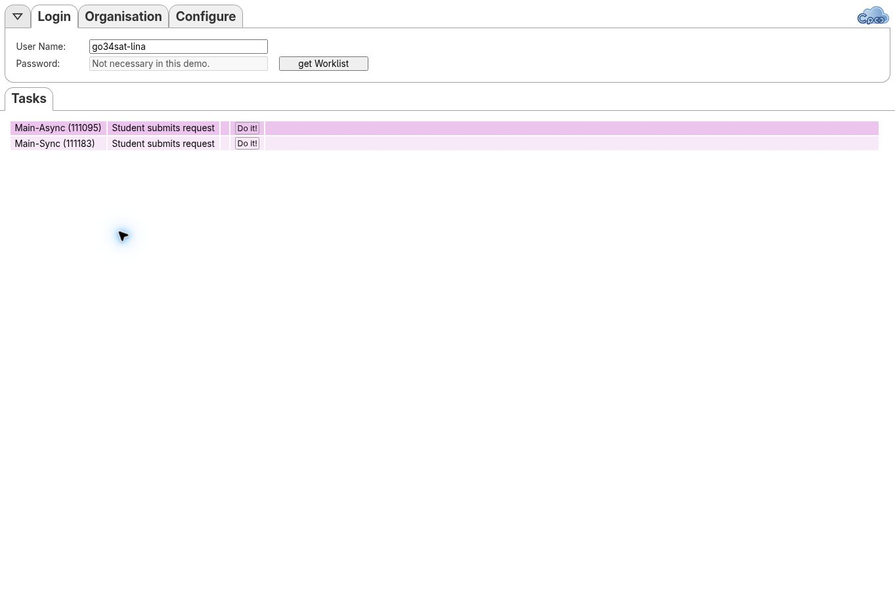

**Result:** Passed. Neither maintenance request blocked future request intake.

### 12.6 Subprocess Creation

The two submissions created two independent child instances:

| Request | Child instance |
|---|---:|
| Sync test | `111209` |
| Async test | `111210` |

Both appeared as separate `Admin review & dispatch` tasks in Admin Jenny's Worklist.

### 12.7 Form-Level Data Transfer

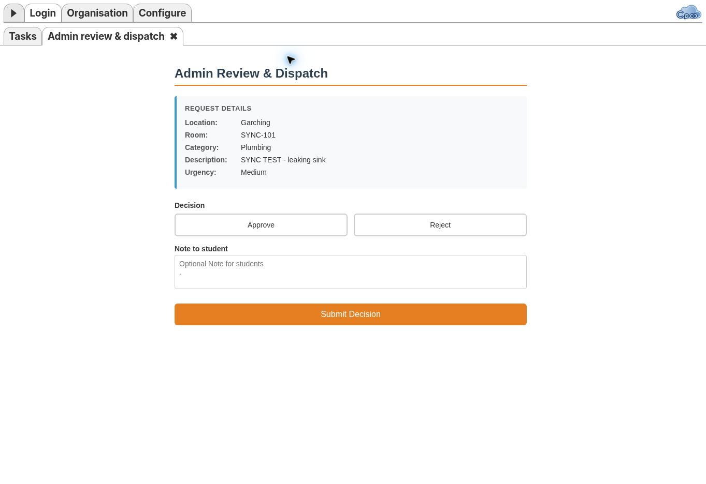

**Figure 19. Sync request data in child instance 111209.** All five request fields were transferred correctly.

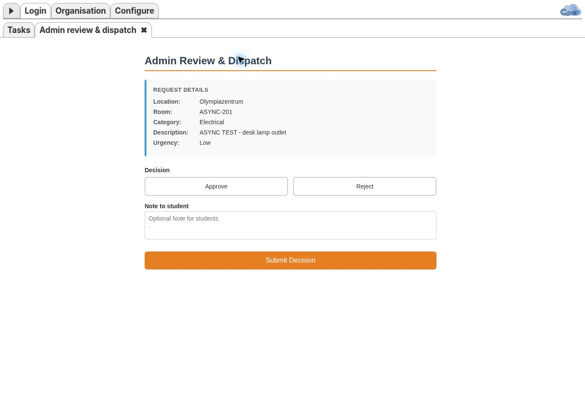

**Figure 20. Async request data in child instance 111210.** The second request contains its own independent values.

### 12.8 Data-Object Verification

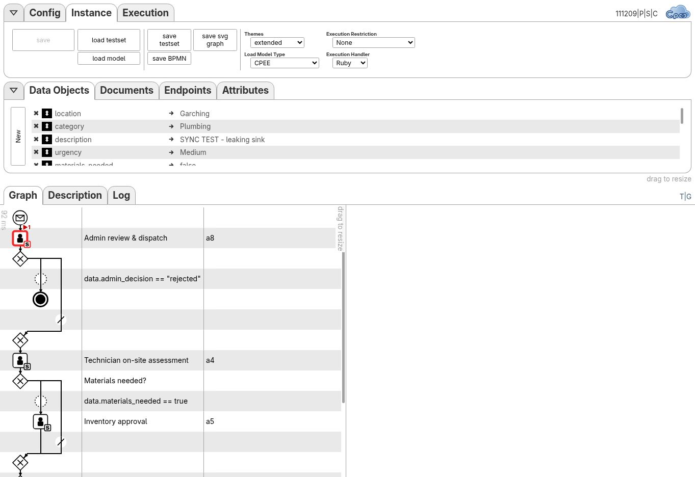

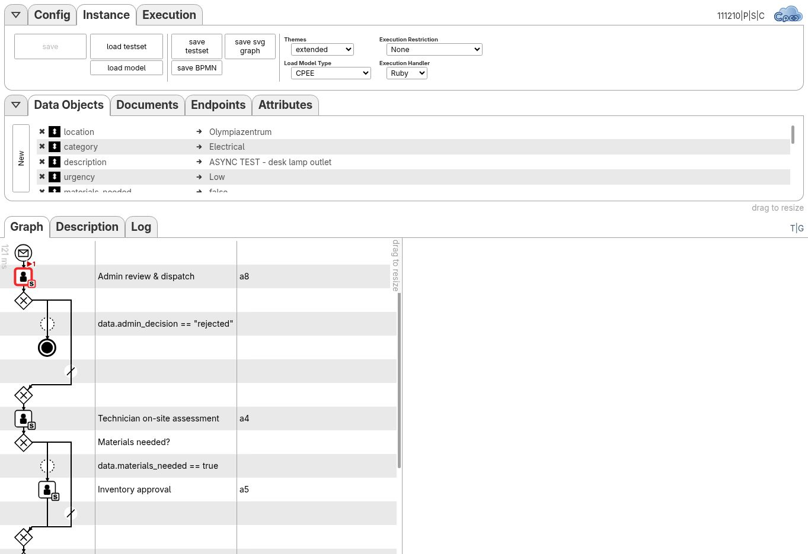

**Figures 21–22. Independent child-process data.** The CPEE Data Objects confirm that the two requests did not overwrite one another.

### 12.9 Test Summary

| Test case | Expected result | Actual result | Status |
|---|---|---|---|
| Sync task claim | Second student cannot see claimed task | Lina saw only Main-Async | Passed |
| Sync submission | Main-Sync creates a new intake task | New task appeared immediately | Passed |
| Async task access | Second student still sees Async task | Renny still saw Main-Async | Passed |
| Async submission | Task remains available | Main-Async remained visible | Passed |
| Sync child creation | One child with Sync data | Instance 111209 created | Passed |
| Async child creation | One child with Async data | Instance 111210 created | Passed |
| Data isolation | Values remain request-specific | Child values were independent | Passed |
| Admin display | Five input fields display correctly | No field displayed `—` | Passed |

---

## 18. Design Evolution

The final architecture resulted from several implementation and review iterations:

1. The original workflow combined request entry and maintenance processing in one long process.
2. This design could prevent students from continuously submitting new requests.
3. The workflow was split into a small main intake process and a reusable maintenance subprocess.
4. The subprocess call was configured with `fork_running` so the main process could continue immediately.
5. A Sync main process was created using a normal single-worker task.
6. An Async main process was created using an always-available task and queue.
7. The administrator's `returned` branch was removed; the final decision is approve or reject.
8. Redundant custom callback JavaScript was removed from the forms.
9. All task Data Elements were aligned with the HTML field names.
10. The organisation model was expanded to include multiple students and dormitory-specific technicians.

This redesign directly addresses the requirement that students must be able to submit new requests while other requests are still being processed.

## 19. Conclusion

The Dormitory Maintenance Worklist System demonstrates how a continuously available request entry point can be separated from long-running request processing in CPEE. The reusable subprocess contains the full maintenance business logic, while two alternative main processes demonstrate different concurrency strategies.

Main-Sync offers the simpler design and synchronizes form access through a single-worker task. Main-Async offers stronger concurrent intake by combining an always-available Worklist task with a FIFO queue. Both versions use `fork_running`, so maintenance processing takes place independently of the next student request.

The final tests verified task visibility, continuous intake, subprocess creation, complete field transfer, and data isolation. The project therefore satisfies its main functional objective: multiple dormitory maintenance requests can be accepted and processed as independent workflow instances without blocking the overall request service.

