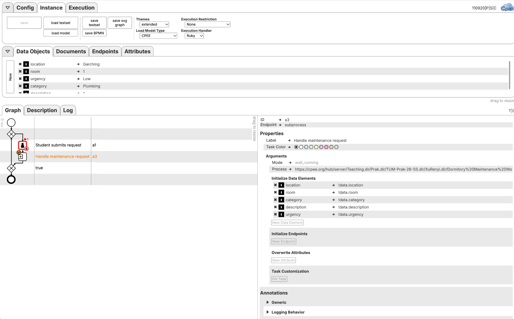
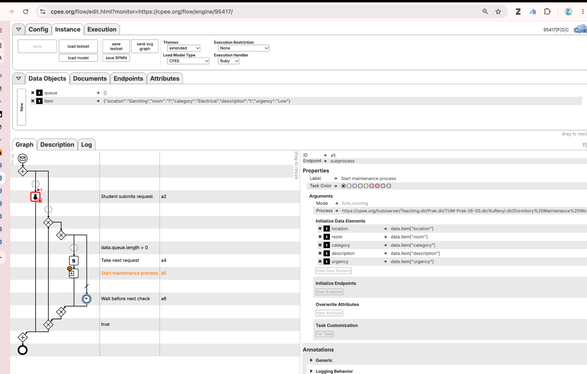
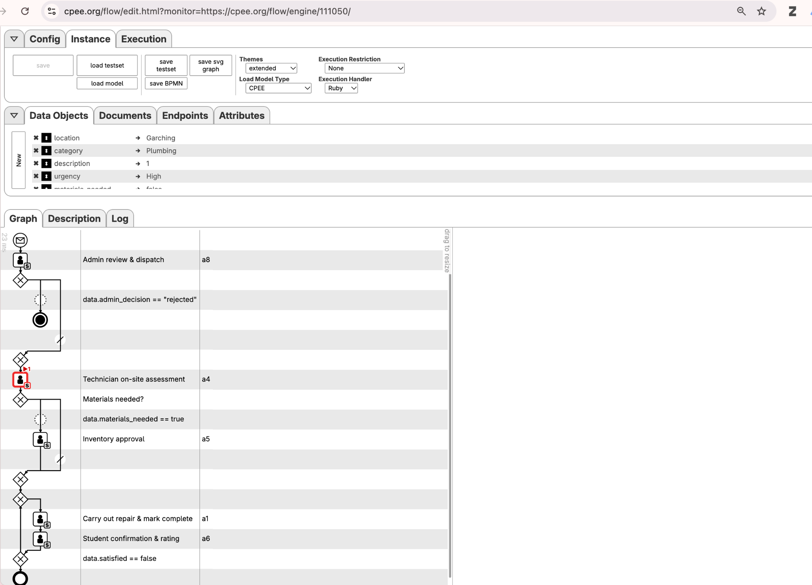
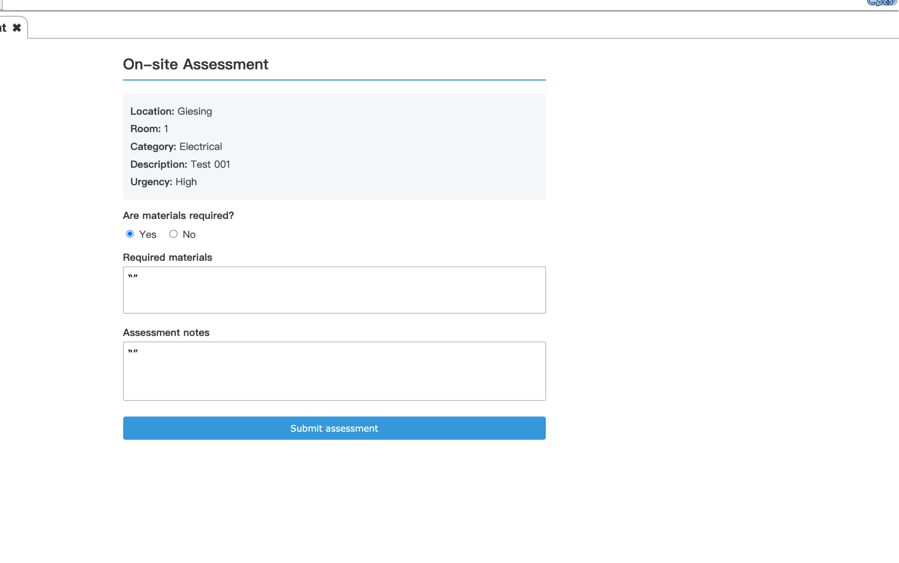

# Dormitory Maintenance Worklist System

## Requirements Specification after Supervisor Meeting

### 1. Project objective

The project implements a dormitory maintenance request system with CPEE and the CPEE Worklist. It coordinates maintenance requests between students, administrators, technicians, and inventory managers. The system must support several independent maintenance requests at the same time instead of blocking all students while one request is being processed.

### 2. Stakeholders and roles

| Role | Responsibility |
|---|---|
| Student | Submit a maintenance request and confirm the completed repair. |
| Admin | Review, approve, or reject a request. |
| Technician | Assess the problem, specify required materials, and complete the repair. |
| InventoryManager | Confirm that requested materials have been issued. |

The organisation model contains the dormitory units `Garching`, `Olympiazentrum`, `Studentenstadt`, and `Giesing`. Tasks should be routed by role and, where applicable, by the dormitory selected in the request.

### 3. Functional requirements

#### FR-01: Submit maintenance request

The student shall be able to enter:

- dormitory/location;
- room number;
- issue category;
- problem description;
- urgency.

In the asynchronous version, the submission task must remain continuously available so that another student can submit a request while existing requests are being processed.

#### FR-02: Administrative review

The administrator shall see the submitted request and choose one of the following decisions:

- `approved`: continue with technical assessment;
- `rejected`: terminate the request.

The administrator may additionally record a note explaining the decision.

#### FR-03: Technician assessment

After approval, a technician assigned to the corresponding dormitory shall inspect the problem and record:

- whether materials are needed;
- the list of required materials;
- assessment notes.

#### FR-04: Material issue

If `materials_needed == true`, an InventoryManager shall receive a task and confirm that the materials have been issued. If no materials are required, this activity shall be skipped.

#### FR-05: Repair completion

The technician shall perform the repair and enter repair notes.

#### FR-06: Student confirmation

The student shall confirm whether the issue has been resolved and provide:

- `satisfied` as a Boolean value;
- a rating from 1 to 5;
- optional feedback.

If `satisfied == false`, the request shall return to the technician assessment and repair section. If `satisfied == true`, the request shall finish.

### 4. Process architecture

The implementation consists of three process models.

#### 4.1 `Dormitory Maintenance Worklist System.xml`

`Dormitory Maintenance Worklist System.xml` represents the complete lifecycle of one maintenance request. It receives the request data from a parent process and contains the administrative review, technical assessment, optional inventory approval, repair, and student confirmation activities.

Each invocation must have its own process data so that requests do not overwrite each other. The input fields must be preserved when the subprocess starts. Only internal result fields, such as decisions, notes, and Boolean status values, may be initialized for the new request.

#### 4.2 `Main-Sync.xml`

The Sync model provides the simpler synchronized-intake implementation:

1. The Student Worklist task uses `By Single Worker` handling.
2. One student claims and submits the current request form.
3. The model starts `Dormitory Maintenance Worklist System.xml` with `fork_running`.
4. The main process does not wait for the maintenance subprocess to finish.
5. The loop immediately creates a new Student request task.

This version supports continuous intake while previous maintenance subprocesses are running, but only one student can claim each current request task. In this project, “Sync” refers to synchronized form access rather than a blocking subprocess call.

#### 4.3 `Main-Async.xml`

The asynchronous model is the target implementation for concurrent request handling. It contains two parallel branches:

1. A continuously available Student Worklist task receives requests and adds them to a queue.
2. A worker loop reads the queue and starts one asynchronous `Dormitory Maintenance Worklist System.xml` subprocess for each request.

The asynchronous main process is a long-running process and is not expected to terminate automatically.

### 5. Queue requirements for `Main-Async.xml`

- The queue shall be initialized once when the main process starts:

  ```ruby
  data.queue = []
  data.item = nil
  ```

- The Student Worklist activity shall use continuous/`Always` handling.
- A submitted request shall be converted into one independent queue item.
- The request shall be added in the activity's `Update` handling because the continuous Worklist activity does not normally reach `Finalize` after every submission.
- Queue items shall contain `location`, `room`, `category`, `description`, and `urgency`.
- The worker shall process requests in FIFO order by removing the first item:

  ```ruby
  data.item = data.queue.shift
  ```

- If `data.queue.length > 0`, the worker shall start a new asynchronous `Dormitory Maintenance Worklist System.xml` instance and pass all five request fields to it.
- If the queue is empty, the worker shall wait approximately five seconds before checking again. This prevents a continuously running empty loop from consuming unnecessary resources.
- Starting one subprocess must not block the worker from starting additional subprocesses for other queued requests.

### 6. Process data

| Field | Type/initial value | Produced or updated by |
|---|---|---|
| `location` | String | Student |
| `room` | String | Student |
| `category` | String | Student |
| `description` | String | Student |
| `urgency` | String | Student |
| `admin_decision` | Empty String | Admin |
| `admin_note` | Empty String | Admin |
| `materials_needed` | `false` | Technician |
| `materials_list` | Empty String | Technician |
| `materials_issued` | `false` | InventoryManager |
| `assessment_notes` | Empty String | Technician |
| `repair_notes` | Empty String | Technician |
| `satisfied` | `false` | Student |
| `rating` | Integer/empty before confirmation | Student |
| `feedback` | Empty String | Student |

Dynamic values in CPEE task configuration must be evaluated as expressions and must not be passed as literal strings such as `data.location`.

### 7. Worklist and form requirements

- Each human activity shall use a dedicated HTML form.
- Every submitted field shall have a `name` that exactly matches its CPEE Data Element.
- Form controls and submit buttons shall be connected to the Worklist form using `form="worklist-form"`.
- The forms shall use the Worklist submission mechanism and shall not implement a separate manual callback with `fetch()`.
- Displayed values shall be loaded from the data supplied by CPEE.
- Boolean strings returned by HTML forms shall be converted to actual Boolean values in CPEE.
- Every task shall contain all Data Elements that it displays or updates.

### 8. Data routing requirements

- Request data must be passed from the Main process to `Dormitory Maintenance Worklist System.xml`.
- Data must remain isolated between concurrently running subprocess instances.
- Admin tasks shall be routed to an Admin responsible for the selected location.
- Technician tasks shall be routed to a Technician responsible for the selected location.
- Inventory tasks shall use the `InventoryManager` role consistently with the organisation model.
- Final confirmations shall be routed to the appropriate Student.

### 9. Acceptance criteria

The implementation is considered complete when all of the following tests succeed:

1. A student can submit a request and all five input values arrive correctly in the subprocess.
2. An administrator can approve or reject the request, and both branches behave correctly.
3. The material approval task appears only when materials are required.
4. A dissatisfied student causes the technical section to repeat; a satisfied student finishes the request.
5. Tasks are assigned to the correct role and dormitory unit.
6. In `Main-Async.xml`, the Student submission task remains available while earlier requests are still running.
7. Two or more submissions create separate `Dormitory Maintenance Worklist System.xml` instances whose data does not overwrite each other.
8. An empty asynchronous queue waits before checking again and does not create unnecessary subprocesses.
9. `Main-Sync.xml` and `Main-Async.xml` both execute successfully.
10. The README explains the architectural difference and trade-off between the synchronous and asynchronous versions.

### 10. Implementation evidence

#### 10.1 Synchronous request handling



*Figure 1: `Main-Sync.xml` synchronizes access to the current Student task, invokes the maintenance subprocess in `fork_running` mode, and immediately loops back to create a new intake task.*

#### 10.2 Asynchronous request handling



*Figure 2: `Main-Async.xml` keeps the student submission activity available, removes requests from the queue, and starts maintenance subprocesses in `fork_running` mode.*

#### 10.3 Maintenance subprocess



*Figure 3: One maintenance subprocess contains administrative review, technician assessment, optional material issue, repair, and student confirmation. The process data at the top demonstrates that request values reached the subprocess.*

#### 10.4 Worklist data transfer



*Figure 4: The technician Worklist form displays the location, room, category, description, and urgency transferred through the process data.*

### 11. Required deliverables

- `Dormitory Maintenance Worklist System.xml`: subprocess for one maintenance request;
- `Main-Sync.xml`: synchronized single-worker intake implementation;
- `Main-Async.xml`: queue-based asynchronous implementation;
- organisation model containing all roles and dormitory units;
- HTML Worklist forms for all human tasks;
- README describing configuration, execution, test users, the two architectures, and known limitations.
